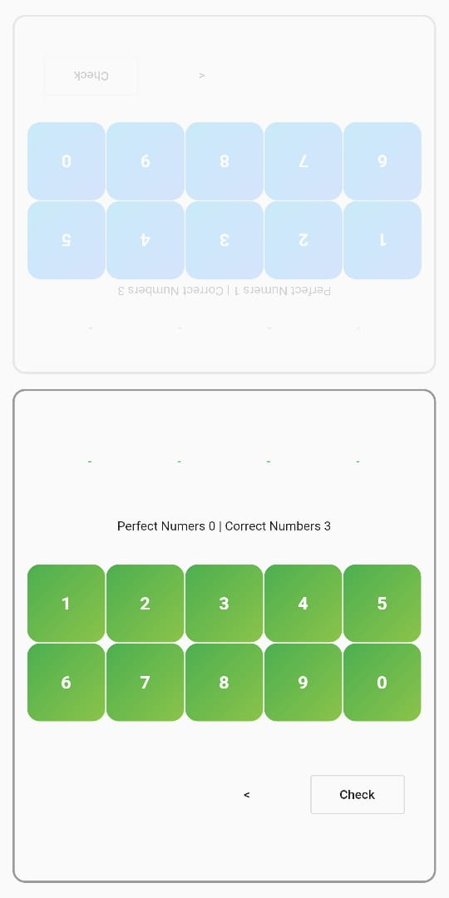
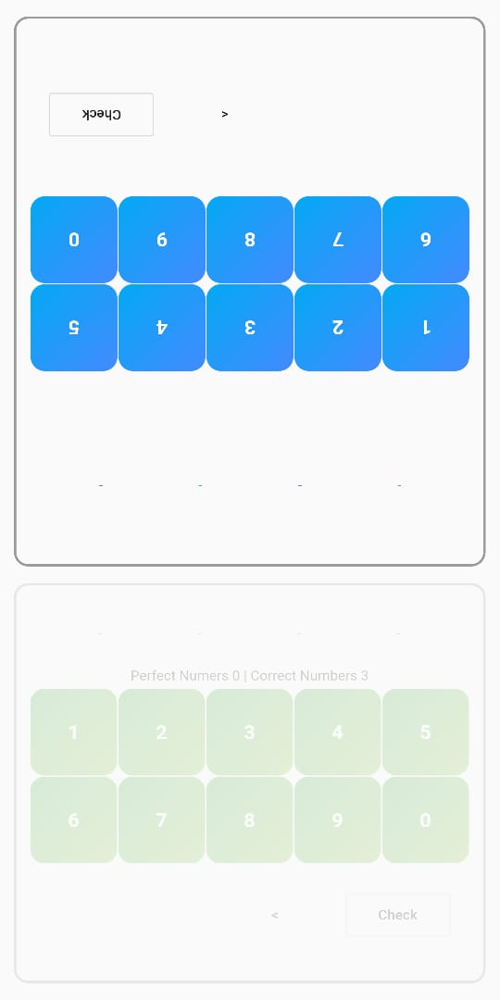

# Guess Number

## Game
App generates a 4 digit number for both players
Aim is to guess the number in same sequence
Who ever guesses first wins the game
both get alternating chance can sit face to face.

Everytime you make a guess you will be given 2 Scores
Perfect and Correct
correct means how many you digits in number guessed are in the generated number
perfect means how many numbers are correct and in place

## ScreenShots

